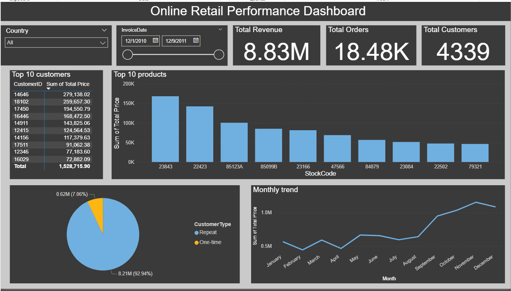

# Online Retail Performance Analysis

End to end analysis of a UK based online gift retailer's transactional data (Dec 2010 – Dec 2011), covering data cleaning, SQL analysis, and an interactive Power BI dashboard.

## Business Questions

1. What are the monthly revenue trends across the year?
2. Who are the top customers by revenue, and how much of total revenue comes from repeat vs one-time customers?
3. Which products and countries drive the most revenue?
4. What does the order cancellation rate look like, and which products are cancelled most often?

## Tools Used

- **Excel / Power Query** — initial data cleaning and exploration
- **MySQL** — data storage, validation, and business-question querying
- **Power BI** — interactive dashboard and DAX calculations

## Process

### 1. Data Cleaning (Excel / Power Query)

Started with ~540K raw transaction line items. Key cleaning steps:

- Split the dataset into two tables: `sales_clean` (genuine completed sales) and `cancellations` (orders with invoice numbers starting with "C"), rather than deleting cancelled orders outright — this preserved them for cancellation-rate analysis instead of losing that information.
- Removed rows with blank `CustomerID`, since customer-level analysis (top customers, repeat-buyer segmentation) isn't meaningful without one.
- Investigated and excluded rows with negative `UnitPrice` (bad-debt adjustment entries, not real sales).
- Added a calculated `TotalPrice` column (`Quantity × UnitPrice`).

### 2. SQL Analysis (MySQL)

Loaded both cleaned tables into MySQL and wrote queries to answer each business question. Along the way, resolved several real data and import issues:

- **Date formatting**: source dates didn't match MySQL's expected `DATETIME` format; imported as text first, then converted using `STR_TO_DATE`.
- **Duplicate rows**: identified ~20 exact-duplicate transaction records using a `GROUP BY` + `HAVING COUNT(*) > 1` check, and removed them with `SELECT DISTINCT`.
- **Column misalignment bug**: after import, the `Country` column was showing numeric values instead of country names. Traced this back to a mismatch between the CSV's actual column order and the table's `CREATE TABLE` column order — since `LOAD DATA INFILE` maps columns by position, this had silently shifted nearly every column for ~99% of rows (including `TotalPrice`, which had been showing as 0 for 11 of 12 months as a result). Fixed by rebuilding the table with column order matching the source file exactly, then re-validating every downstream query.
- **Non-product entries**: used a regex filter (`StockCode REGEXP '^[A-Z]+$'`) to surface non-numeric stock codes, manually reviewed each one, and excluded administrative entries (`POST` – postage, `M` – manual adjustments, `DOT` – dotcom postage) from product-level revenue analysis while correctly keeping genuine letter-coded products (e.g. `PADS`).

### 3. Dashboard (Power BI)

Connected the cleaned data into Power BI and built a single-page interactive dashboard with:

- **Headline metrics**: Total Revenue, Total Orders (distinct invoices), Total Customers (distinct customer IDs)
- **Monthly revenue trend** (line chart)
- **Top 10 products by revenue** (bar chart, with full product description on hover)
- **Top 10 customers by revenue** (table)
- **Repeat vs one-time customer revenue split** (donut chart)
- **Slicers**: Country and date range, for interactive filtering

## Key Findings

- **Revenue is highly seasonal**, with a clear upward trend through the second half of the year, consistent with a gift retailer building toward the holiday season.
- **Repeat customers drive ~91% of total revenue**, despite the customer base including a meaningful share of one-time buyers. This suggests retention initiatives are likely to have a larger business impact than acquisition spend alone.
- **The UK dominates revenue** by a wide margin over all other countries, consistent with the business being UK-based.
- **A small number of products account for a disproportionate share of revenue** — the top 10 products by revenue make up a significant fraction of total sales, after excluding non-product entries like postage and manual adjustments from the analysis.
- **The order cancellation rate is 16.47%** — roughly one in six orders is cancelled. Cancellations are not evenly distributed across products; a subset of products account for a disproportionate share of cancelled orders, which may warrant further investigation into product quality, description accuracy, or fulfillment issues for those specific items.

## Dashboard Preview

## Files in This Repository

- `sql_queries.sql` — all SQL queries used for analysis
- `dashboard.pbix` — Power BI dashboard file
- `README.md` — this file

